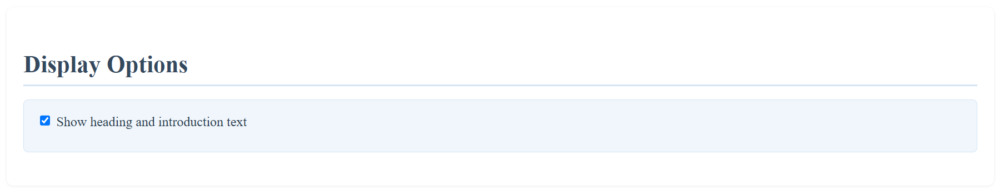
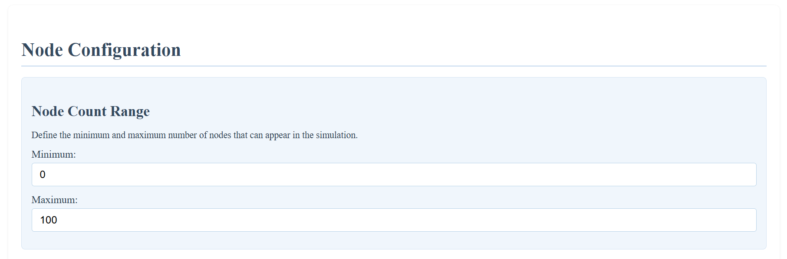
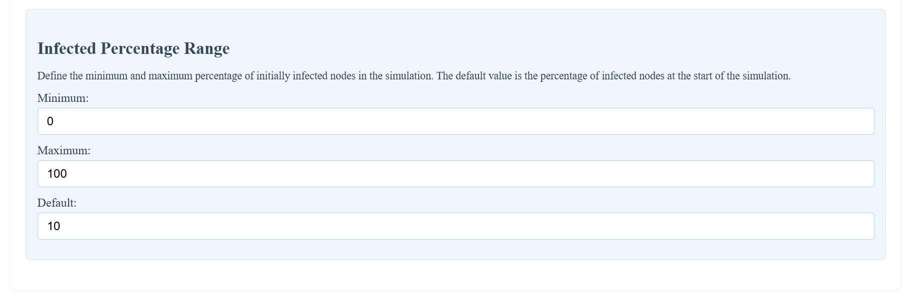
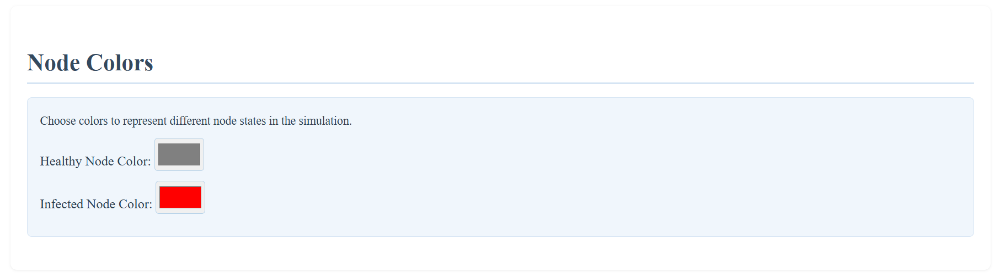
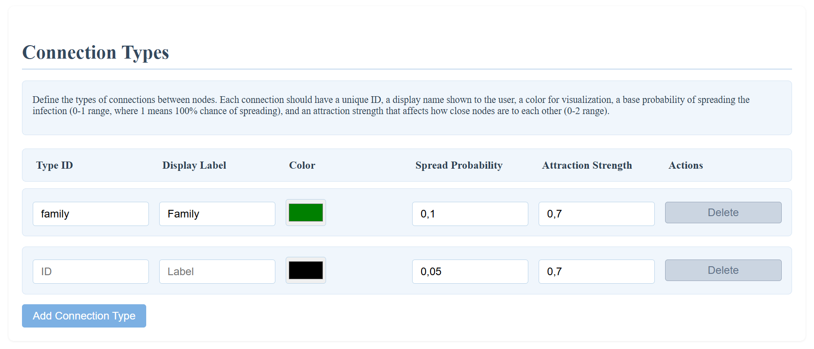
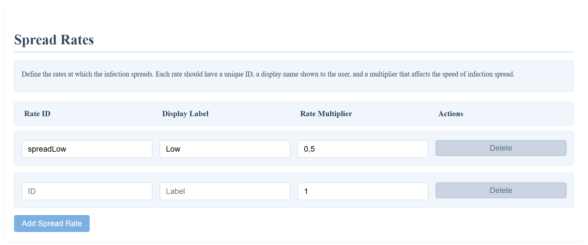
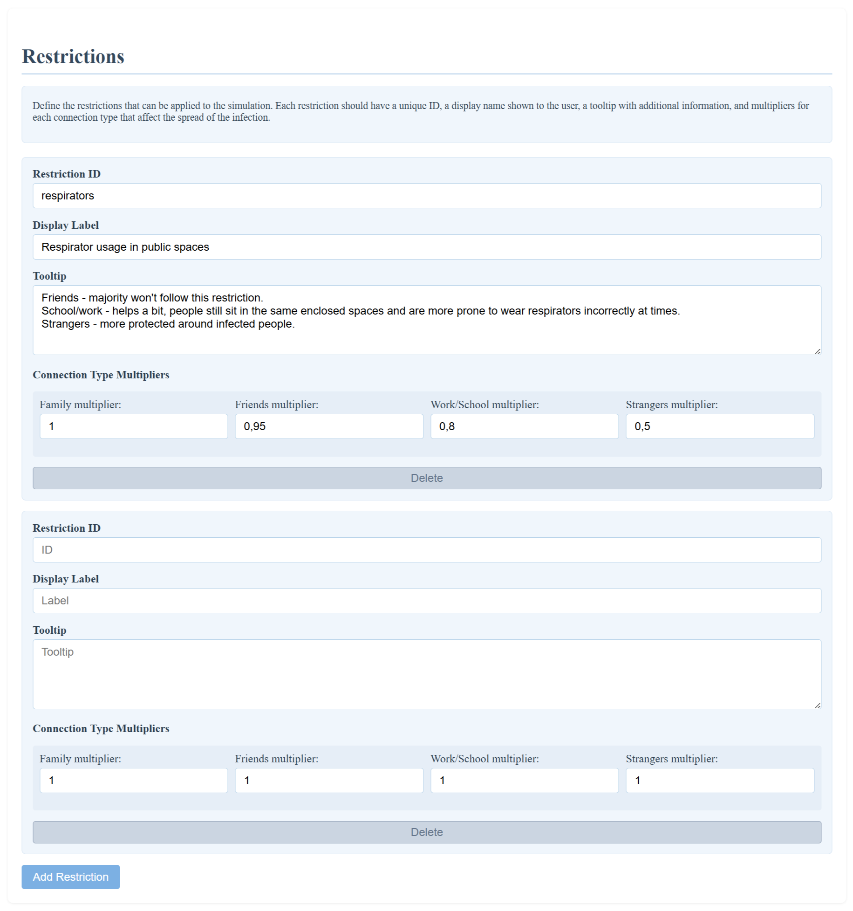
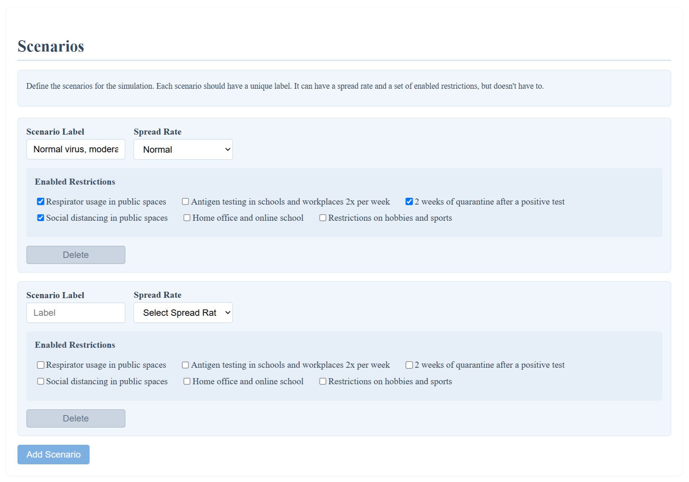
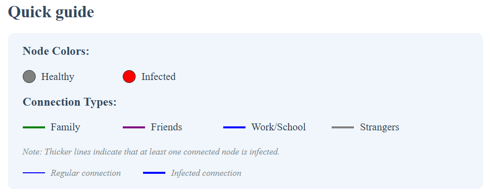
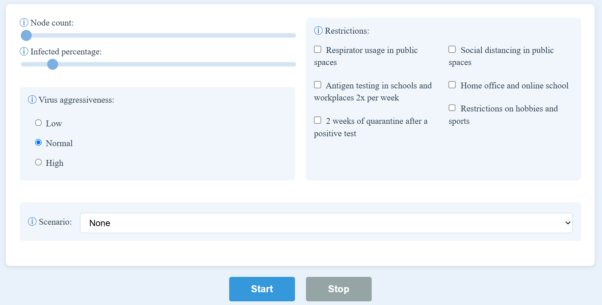

# Accessing the Project
The project is hosted on GitHub Pages. You can access it at the following link:

[Interactive pandemic simulation to encourage critical thinking
](https://sarianille.github.io/CovidSimulation/)

# Running the Project Locally

You need to have Node.js installed. If you don't have it installed,
you can download it from [here](https://nodejs.org/).

1. Package installation:
- Open a terminal in the project directory.
- Run `npm install`.

2. Running the project:
- Run `npx vite`.

3. Accessing the project:
- Open a browser and go to the link provided by Vite.

# Using the Configuration Generator

The configuration generator is separated into several sections. Each section allows you to customize a different aspect of the simulation.

In display options, you can choose whether to show the heading and introduction text. This is done by checking or unchecking the corresponding box.

Node configuration is split into two subsections. 

The first subsection, node count range, allows you to set the minimum and maximum number of nodes that can be generated for the simulation. You can set the values by writing them in the input boxes.

The limits of the range slider will correspond to these values.

The second subsection, infected percentage range, allows you to set the minimum, maximum, and default percentage of infected nodes. You can set the values by writing them in the input boxes.

The limits of the range slider will correspond to the minimum and maximum values. The slider will be initially be set to the default value.

In node colors, you can set the colors of the different node states. You can choose the colors by clicking on the color boxes and selecting the desired color from the color picker.

In connection types, you can decide which connection types will appear in the simulation. You can delete or add connection types by clicking on the corresponding buttons. You can set the ID, label, spread probability, and attraction strength of each connection type by writing the values in the input boxes. You can set the color by selecting it from the color picker.

These will be represented by the lines connecting the nodes in the simulation.

In spread rates, you can delete or add spread rates by clicking on the corresponding buttons. You can set the ID, label, and spread rate multiplier of each spread rate by writing the values in the input boxes.

These will indicate how aggressive the virus is. They will multiply the spread probability of each connection type by their multiplier value.

In restrictions, you can decide which restrictions will be possible to apply in the simulation. You can delete or add restrictions by clicking on the corresponding buttons. You can set the ID, label, and tooltip of each restriction by writing the values in the input boxes. You can set how it affects each connection type by writing in the corresponding input box.

In scenarios, you can decide which scenarios will be pre-defined in the simulation. You can delete or add scenarios by clicking on the corresponding buttons. You can set the label by writing in the input box. You can set the spread rate by choosing from the dropdown menu. You can choose which restrictions will be applied by checking the corresponding boxes.

Once you are done configuring the simulation, you can create it by clicking on the "Create Simulation" button. This will generate a new simulation with the parameters you set.

The code for the simulation will be generated in a text area below the simulation itself.

If you want to change something in the configuration after testing the simulation, you can click on the "Back to Configuration" button. This will take you back to the configuration page. Your configuration will be saved, so you can continue working on it.

If you want to embed the simulation in your website, you can click on the "Copy Simulation" button. This will copy the HTML code to your clipboard. You can paste it in your website to embed the simulation.

# Using the Simulation

The simulation has an intuitive user interface.

You can see the guide on the top of the page. It will show you which node color corresponds to which node state, which connection type color correspond to which connection type, and how to differentiate between regular and infected connections.

You can customize the simulation by changing the parameters. Your options include: the number of nodes, the initial number of infected nodes, the aggressiveness of the virus, and several restrictions. You can also drag the nodes around for a more interactive experience and better visibility.

You can choose from predefined scenarios or create your own. The changes you make will be reflected in the simulation.

You start the simulation by clicking the "Start" button. You can pause and resume the simulation at any time. The simulation will stop when there are no more nodes to infect.

You can view the spreading of the virus in real-time. The nodes will change color to indicate their status. You can also view the number of newly infected nodes and the total number of infected nodes in the chart below the simulation graph. The chart will update with each tick of the simulation.